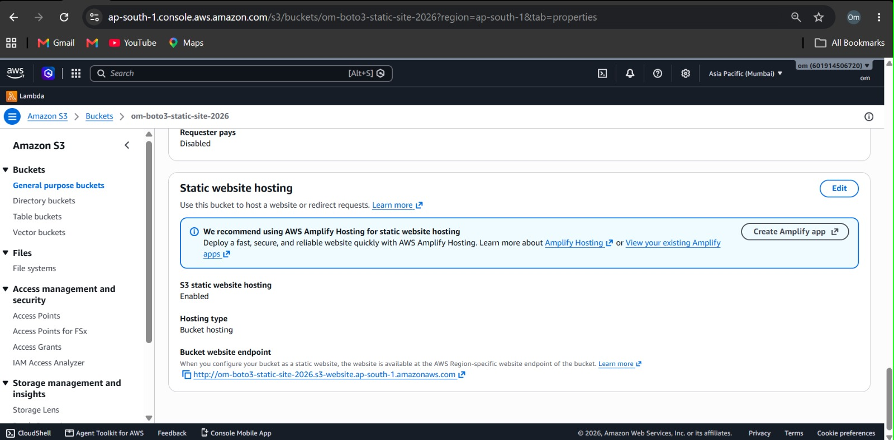
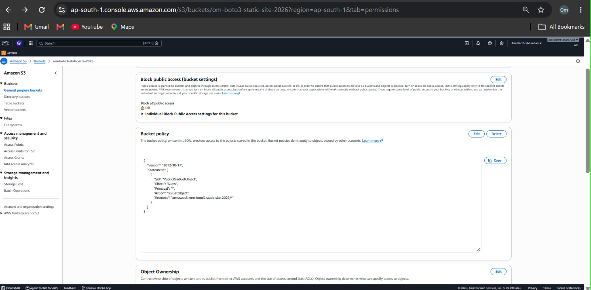
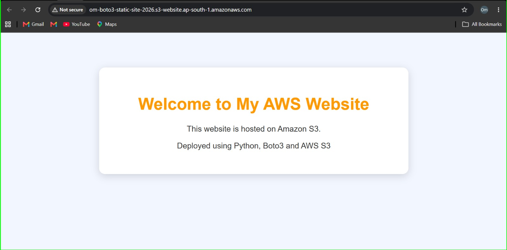
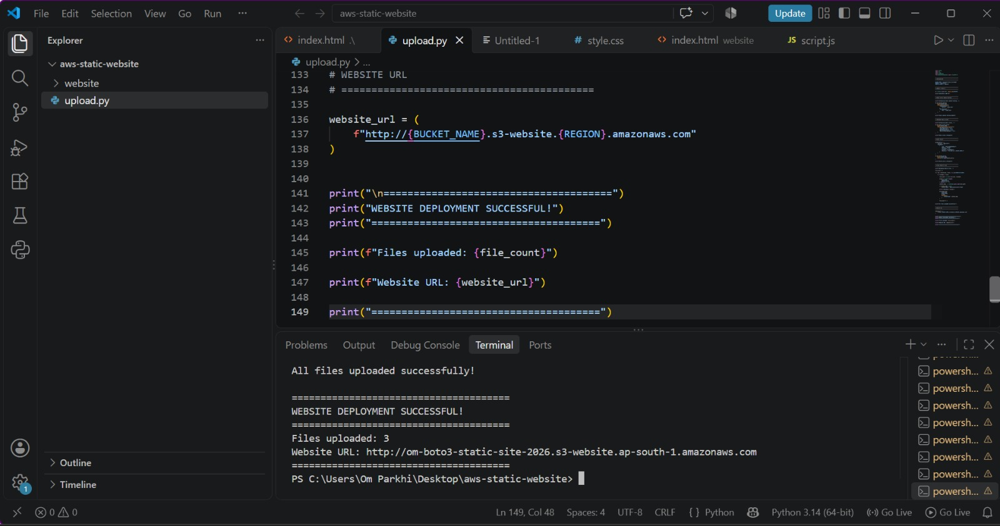

# Automated Static Website Hosting Using AWS SDK

## Project Title and Objective

**Project Title:** Automated Static Website Hosting Using AWS SDK

**Objective:**

The objective of this project is to automate the deployment of a static website to Amazon S3 using Python and the Boto3 SDK instead of manually uploading files through the AWS Management Console.

The Python script uploads website files, configures static website hosting, sets the required public access permissions, and displays the website URL after successful deployment.

## AWS Services Used

- **Amazon S3:** Stores website files and hosts the static website.
- **AWS IAM:** Manages permissions required to access S3.
- **Python:** Automates the website deployment process.
- **Boto3:** Python SDK used to interact with AWS services.
- **AWS CLI:** Configures AWS credentials and verifies access.
- **HTML:** Creates the website structure.
- **CSS:** Styles the website.
- **JavaScript:** Adds functionality to the website.

## Architecture / Workflow

```text
Website Files (HTML, CSS, JavaScript)
                 |
                 v
           Python Script
             (Boto3)
                 |
                 v
             Amazon S3
                 |
                 v
      Static Website Hosting
                 |
                 v
          Public Website URL
                 |
                 v
           User's Browser
```

## Implementation Steps

### Step 1: Create an S3 Bucket

Created an S3 bucket named:

`om-boto3-static-site-2026`

AWS Region: `ap-south-1` (Asia Pacific - Mumbai)

The bucket stores all the static website files.

### Step 2: Create Website Files

Created a website folder containing the following files:

- `index.html`
- `style.css`
- `script.js`

These files define the structure, design, and functionality of the website.

### Step 3: Install Python and Boto3

Installed Python and the Boto3 SDK.

Command:

```bash
python -m pip install boto3
```

### Step 4: Configure AWS Credentials

Configured AWS credentials using the AWS CLI.

Command:

```bash
aws configure
```

Verified AWS identity using:

```bash
aws sts get-caller-identity
```

### Step 5: Develop the Python Deployment Script

Created a Python script named `upload.py` using Boto3.

The script performs the following tasks:

- Connects to Amazon S3.
- Configures static website hosting.
- Configures the required public access settings and bucket policy.
- Uploads website files recursively from the website folder.
- Sets the appropriate content type for each uploaded file.
- Displays the deployment status and website URL.

### Step 6: Run the Deployment Script

Executed the following command in the VS Code terminal:

```bash
python upload.py
```

The script successfully uploaded all three website files to Amazon S3.

### Step 7: Verify Website Deployment

Verified the uploaded files in the S3 bucket and opened the website endpoint in a browser.

The website was successfully deployed and is accessible through its S3 static website endpoint.

## Screenshots of Important Configurations and Results

### 1. S3 Bucket Objects


### 2. Static Website Hosting


### 3. Bucket Permissions


### 4. Live Website


### 5. Python Boto3 Deployment


## How to Run or Deploy the Project

### Prerequisites

- An AWS account.
- Python installed on the system.
- AWS CLI installed and configured.
- Boto3 installed.
- An existing S3 bucket.
- Website files inside the `website` folder.

### Step 1: Install Boto3

```bash
python -m pip install boto3
```

### Step 2: Configure AWS Credentials

```bash
aws configure
```

Configure the credentials for an AWS identity with the required S3 permissions.

### Step 3: Prepare the Project Folder

The project folder should have the following structure:

```text
aws-static-website/
│
├── upload.py
│
├── website/
│   ├── index.html
│   ├── style.css
│   └── script.js
│
└── README.md
```

Create a `screenshots` folder to store the project screenshots.

### Step 4: Configure the Script

Update the bucket name, AWS Region, and website folder in `upload.py` if required.

Make sure the S3 bucket already exists and the configured AWS identity has the necessary permissions.

### Step 5: Run the Script

```bash
python upload.py
```

### Step 6: Open the Website

Website URL:

http://om-boto3-static-site-2026.s3-website.ap-south-1.amazonaws.com

**Note:** This project intentionally enables public read access so users can view the static website. The S3 website endpoint uses HTTP. Never upload AWS access keys or secret credentials to GitHub.

## Key Learnings

- Learned how to use Amazon S3 for static website hosting.
- Learned how to automate AWS tasks using Python and Boto3.
- Learned how to upload website files programmatically.
- Learned how to configure static website hosting using Python.
- Learned how to set content types for different website files.
- Learned how to configure S3 bucket policies and public access settings.
- Learned how to verify AWS resources using the AWS CLI.
- Learned how to deploy a website without manually uploading each file through the AWS Console.

## Conclusion

Successfully developed and implemented an automated static website deployment solution using Python, Boto3, and Amazon S3.

The project demonstrates how AWS resource configuration and website file uploads can be automated using a Python script, reducing manual effort and making the deployment process easier.
